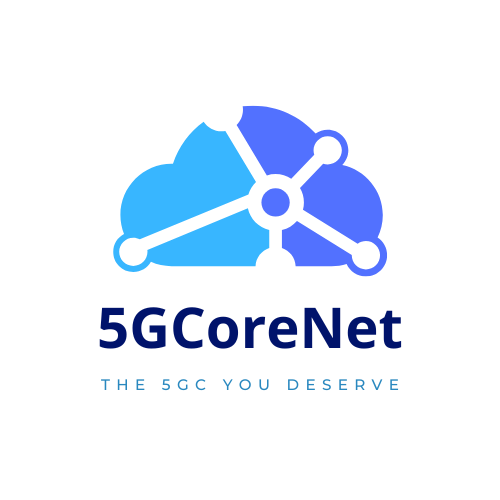

# 5GCoreNetSDK

[](https://pkg.go.dev/github.com/5GCoreNet/5GCoreNetSDK)
[](https://goreportcard.com/report/github.com/5GCoreNet/5GCoreNetSDK)
[](LICENSE)

> At this moment, this SDK is in development. It is not ready for production use.
> Refers to the [Roadmap](#roadmap) section for more information on what has been done.
>
> See the [Contributing](#contributing) section if you would like to help make it better.


<p align="center" width="100%">
     
</p>

5GCoreNetSDK is an open source project that provides a set of APIs to access or expose a Network Function (NF) in 5G Core Network. 
The APIs are based on the 3GPP specifications and are implemented in Golang.

Under the hood, the SDK exposes the standard HTTP RESTful API for the Network Function you've built. 
The RESTful APIs are implemented using [Gin](https://github.com/gin-gonic/gin) framework.

The SDK follows the R18 3GPP specifications.

## Getting Started

```bash
go get github.com/5GCoreNet/5GCoreNetSDK
```

## Features

- Simple and easy to use, just implement the interface you need, and you are ready to go
- Support for both Server and Client mode
- Follows the 3GPP specifications out of the box (R18)
- C compatible thanks to [cgo](https://golang.org/cmd/cgo/)
- Fully open source and free to use, modify, and distribute under the terms of the [Apache 2.0 license](LICENSE)

## Roadmap

As 5GCoreNetSDK is still in development, the following table is the roadmap representing what has been done and what is still to do.
The following table shows the status of the APIs and the order in which they will be implemented. If you want to see a specific API implemented,
you can open an issue (or you can implement it and open a pull request).

Network Function | API  | Status          | Comments                                                                                | Documentation
---------------- |------|-----------------|-----------------------------------------------------------------------------------------| -------------
LMF | NLMF | In progress     | NLMF is the first API proposal and is considered as a PoC. NLMF might change in future. | [Link](fivegc/nlmf/examples/main.go) 
NRF | NNRF | Not implemented |                                                                                         |
AMF | NAMF | Not implemented |                                                                                         |
SMF | NSMF | Not implemented |                                                                                         |
UDM | NUDM | Not implemented |                                                                                         |
UDR | NUDR | Not implemented |                                                                                         |
AUSF | NAUSF | Not implemented |                                                                                         |
PCF | NPCF | Not implemented |                                                                                         |
NSSF | NNSSF | Not implemented |                                                                                         |
N3IWF | NN3IWF | Not implemented |                                                                                         |
UPF | NUPF | Not implemented |                                                                                         |


> Note that API is considered implemented if it is implemented in the SDK in Server and Client mode and if it is tested and documented.

## Contributing

Contributions are welcome! Please read the [Contributing Guide](docs/CONTRIBUTING.md) for more information.